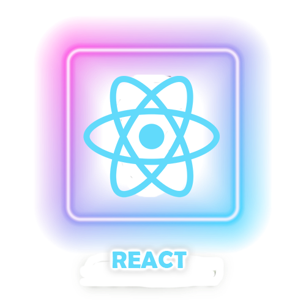
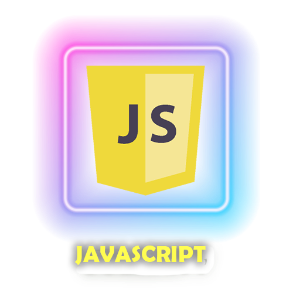
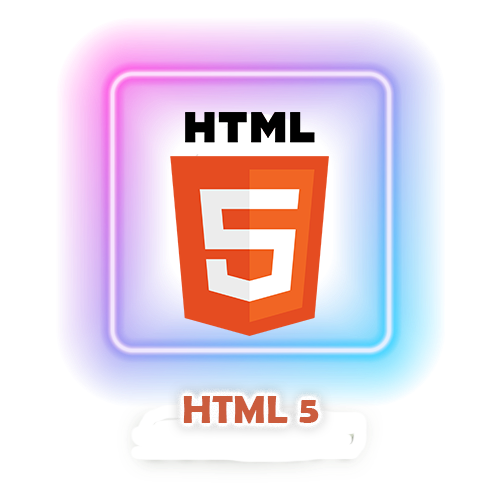
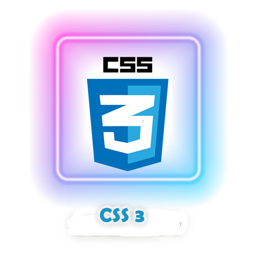
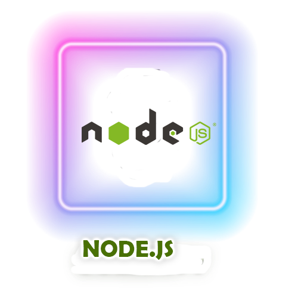
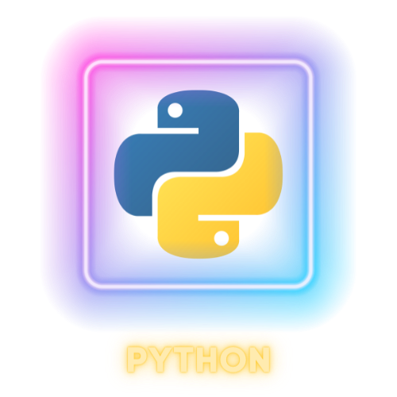
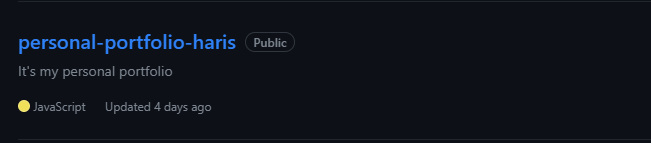
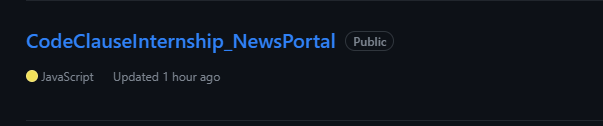
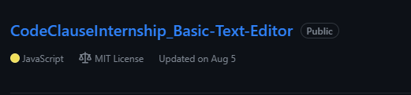

<h1 align="center">
  
</h1>

<!--- assets are created on Canva & Photoshop--->
<!--- Feel free to download the assets and use them in your profile --->
<!--- to upload an asset, create an issue on any of your repositories and add files, the link will be generated --->

<!--- animated text, to copy, just replace the lines with your choice or visit https://readme-typing-svg.herokuapp.com --->
  
<!---

--->
  
<!--- header image --->

  
<!--- portfolio launch image --->
  

  
<!--- social media icons, you can find them in the assets directory of this repo --->
  
 

  
<!--- a bit of vertical space & languages text --->
  

&nbsp;

  

  
  
<!--- language icons --->
  
  
<!--- 

 
--->
  

  
&nbsp;
<h1 align="center">
  ABOUT ME
</h1>
  
  

  I'm KHALED ALI AHMED, an Electrical and Computer Engineering Master's student with a knack for software development, based in Windsor, ON. Venturing beyond computer science, I'm on a mission to master various tech fields, backed by a history of courses and internships globally.
    
  At Cognizant Technology Solutions, I refined my skills in database management and project collaboration, contributing to team productivity and embracing cloud-based tools.
    
  My current studies at the University of Windsor, set to conclude in December 2024, reinforce my technical foundation, which includes SQL, Python, Java, and C. Outside academia, I contribute to open-source projects, champion creative design, and am driven by continuous learning and excellence.
    
  📫 Reach me at <a href="mailto:ahmed481@uwindsor.ca">ahmed481@uwindsor.ca</a> | <a href="https://github.com/Engineered0" title="GitHub">GitHub</a>

  

  
 
  
 

  
  
  
  

 
  

<!--- Github snack contribution graph --->
  

 

<b>Top Repositories</b>

       

 

       

<!--- building footer with spaceship question --->
  

 
 

<!---
Engineered0/Engineered0 is a ✨ special ✨ repository because its `README.md` (this file) appears on your GitHub profile.
You can click the Preview link to take a look at your changes.
--->
